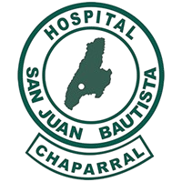
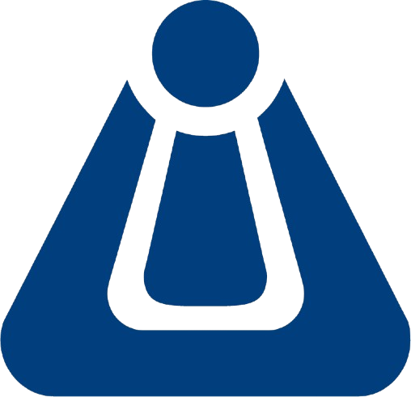

# Gestor de Documentos Hosjuba – Backend

Este proyecto es el **backend de una aplicación web full stack** diseñada para digitalizar la captura de firmas mediante un **pad de firma**, con el fin de gestionar documentos y comprobantes de facturación médica. Fue desarrollado específicamente para el **Hospital San Juan Bautista**, como parte del programa **Paz y Región** de la **Universidad de Ibagué**.

<div align="center">
  
  &nbsp;&nbsp;&nbsp;&nbsp;
  
</div>

## 👨‍💻 Desarrollador

**Juan Sebastián Murillo Méndez**  
[](https://www.linkedin.com/in/juan-sebastian-murillo/)  
[](https://github.com/tu-usuario-github)  
[](https://tu-portafolio.com)

---

## 🚀 Tecnologías Utilizadas

- **Framework:** NestJS v11.0.5  
- **Node.js:** v20.19.0  
- **Base de datos:** MongoDB y conexión a SQL Server (lectura)  
- **Autenticación:** JWT (Json Web Token)  
- **Contenerización:** Docker + Docker Compose  
- Librerías auxiliares: GridFS, PDFKit, Class-validator

---

## ⚙️ Scripts disponibles

En el directorio del proyecto, puedes ejecutar:

### `npm install --legacy-peer-deps`

Instala todas las dependencias necesarias del proyecto.  
> ⚠️ **Nota:** Debido a las versiones de NestJS y Node utilizadas, es necesario instalar las dependencias usando el flag `--legacy-peer-deps`.

### `npm run start:dev`

Ejecuta la aplicación en modo desarrollo con recarga automática.

### `npm run start:prod`

Ejecuta la aplicación en modo producción.

### `docker-compose up --build`

Levanta los servicios del backend y la base de datos MongoDB utilizando contenedores Docker.

---

## 📁 Estructura del Proyecto

src/

├── auth/  
├── controller/  
├── dto/  
├── interceptor/  
├── middleware/  
├── schemas/  
├── service/  
├── config/  
├── app.module.ts  
├── main.ts  

---

## 📝 Notas Adicionales

- Este proyecto gestiona la autenticación, almacenamiento de firmas digitales, generación de documentos PDF y manejo de logs de actividad.
- Utiliza MongoDB para almacenar documentos y firmas, y realiza consultas de solo lectura sobre SQL Server (Sistema Hosvital).
- Se implementa autenticación JWT con manejo de access tokens y refresh tokens.
- Incluye mecanismos de seguridad como guards, interceptores de renovación de tokens y validación de sesiones.

---

## 📦 Despliegue

El backend puede ser desplegado utilizando **Docker** y **Docker Compose**, siguiendo estos pasos:

1. Asegúrate de tener instalado Docker y Docker Compose en el servidor.
2. Ejecuta:

```bash
docker-compose up --build
```

Esto levantará:

- El backend NestJS en el puerto `3000`.
- La base de datos MongoDB en el puerto `27017`.
- La red privada `hosjuba-network` para la comunicación entre servicios.

3. El archivo `.env` debe contener las credenciales y configuraciones necesarias, incluyendo la conexión a MongoDB y SQL Server.

> 🔥 **Importante:** No eliminar los volúmenes de Docker (`docker-compose down -v`) sin antes hacer un respaldo de los datos de MongoDB.

---
